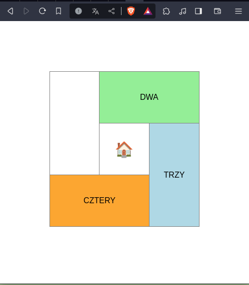

# 314-Sprawdzian_PITSI
314-Sprawdzian PITSI

        Przygotuj witrynę składającą się z 5 podstron. Nawigacja między stronami
        odbywa się przy pomocy linków (JEDEN, DWA ...), a powrót do strony
        początkowej po kliknięciu na ikonę domu o kodzie "&#127968;".

- Linki umieszczone w tabeli przedstawionej na obrazach (rozmiar komórki 100px X 100px). Komórki różnokolorowe.
- Nawigacja między podstronami przy pomocy linków (bez podkreślenia i w kolorze czarnym)
- Font "Arial" i wyrównanie komórek do środka
- Tabela wyśrodkowana w poziomie i odsunięta od górnej krawędzi o 100px
- Czarna ramka 1px wokół komórek i zapadnięte krawędzie tabeli

